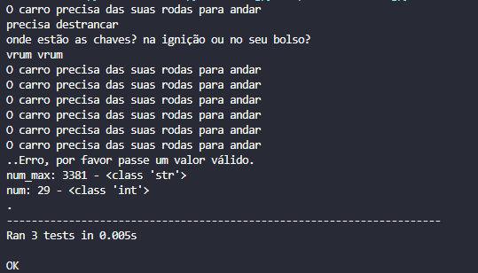

# Tomada de testes unitários
> Exemplos básicos de testes com strings, inteiros, decimais, booleanos.

 

 

## Instalação

<ol>
    <li>Clone o projeto</li> 
    <li>Baixe Python e uma IDE</li> 
    <li>Abra o terminal e execute:</li> 
    <code>python3 -m venv venv source venv/bin/activate</code> (Linux)<code> venv/Scripts/.\activate</code> (Windows)  
    <li>Execute o arquivo _test.py</li>
</ol>

## Meta
 

<h2>Guilherme Bracero Gonzales</h2>

 

LinkedIN - [Guilherme Bracero](https://www.linkedin.com/in/guilherme-bracero/)
 
Instagram - [Bracero](https://instagram.com/guilhermebracero)
 
Email - [guibragon@gmail.com](www.gmail.com) 
